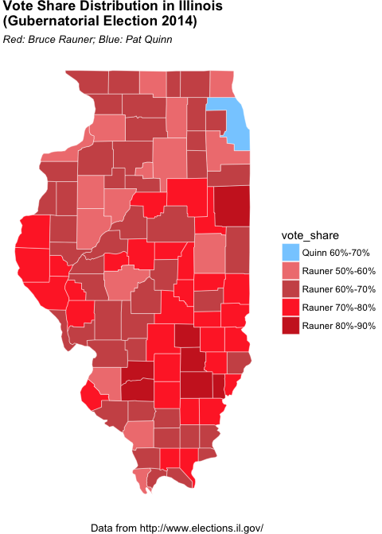
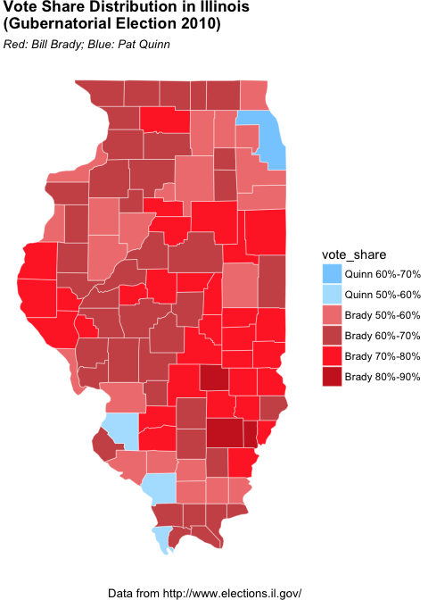
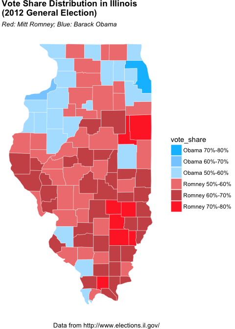

Election Map in Illinois (2010-2016)
================
Yanning Cui
February 12, 2018

This tutorial shows you how to reproduce a vote distribution map for illinois using R, ggplot and plotly

Load Libraries
--------------

``` r
#install libraries if you haven't
library(plotly)
library(dplyr)
```

Read Data
---------

How to generate the data?

1.  Download data here: <http://elections.il.gov/ElectionInformation/DownloadVoteTotals.aspx>
2.  Filter out other races and parties. Keep only **Republican and Democratic** for **President/Vice President** (2016 and 2012) OR **GOVERNOR AND LIEUTENANT GOVERNOR** (2010 and 2014). (i.e. For 2016, you'll only have trump vs clinton; For 2012, you'll only have romney vs obama)
3.  Get **the sum of votes for each candidate in every county**.
4.  **Sum the total votes for each county** (total votes = repCandidateVote + demCandidateVote.
5.  *Join two datasets, calculate the vote percentage for each candidate*, and keep columns needed

Clean Data: Use 2014 as an example
----------------------------------

``` r
data <- read.csv("data/GE2014Cty.csv")
data_filter <- data %>%
  filter(OfficeName == "GOVERNOR AND LIEUTENANT GOVERNOR") %>%
  filter(PartyName == "REPUBLICAN" | PartyName == "DEMOCRATIC")
data_total <- aggregate(data_filter$Votes, by=list(County=data_filter$County), FUN=sum)
data_join <- inner_join(data_filter, data_total, by = "County")
data_final <- data_join %>%
  mutate(rauner = Votes/x) %>%
  mutate(quinn = 1-rauner) %>%
  select(County, rauner, quinn)
head(data_final,10)
```

    ##      County    rauner     quinn
    ## 1    GREENE 0.7087208 0.2912792
    ## 2   HANCOCK 0.7607766 0.2392234
    ## 3    JERSEY 0.6946850 0.3053150
    ## 4    MORGAN 0.6932716 0.3067284
    ## 5      OGLE 0.6914036 0.3085964
    ## 6     PIATT 0.7450951 0.2549049
    ## 7      PIKE 0.7642246 0.2357754
    ## 8  RICHLAND 0.7506388 0.2493612
    ## 9     LOGAN 0.7270924 0.2729076
    ## 10   FULTON 0.5097054 0.4902946

Prep Data: get longitude and latitude for each county
-----------------------------------------------------

``` r
#in built datasets with county names
county_df <- map_data("county")
state_df <- map_data("state")

#this function returns a data frame with long and lat before drawing the map
makedf <- function(repCandidate, demCandidate, df){
  #df <- read.csv(file)
  #regular expression to clean county name in both df, so they can match and join
  df$County %<>%
    gsub(" county", "", .) %>%
    gsub(" parish", "", .) %>%
    gsub(" ", "", .) %>%
    gsub("[.]", "", .) %>%
    gsub("County", "", .) 
  df$county_name = tolower(df$County)
  county_df <- county_df %>%
    filter(region == "illinois") #we only need illinois
  county_df$subregion <- gsub(" ", "", county_df$subregion)
  names(df)[names(df) == 'county_name'] <- 'subregion'
  #join two df based on 'subregion', remove duplicates
  choropleth <- inner_join(county_df, df, by = "subregion")
  choropleth <- choropleth[!duplicated(choropleth$order), ]
  #convert vote percentage to numbers between 0-100, cut it into 10 bins
  choropleth[,c(repCandidate)] <- choropleth[,c(repCandidate)] * 100
  choropleth[,c(demCandidate)] <- choropleth[,c(demCandidate)] * 100
  choropleth <- choropleth %>%
    mutate(vote_share = cut(choropleth[,c(repCandidate)], breaks=seq(0,100, by=10), include.lowest=TRUE))
  return(choropleth)
}
```

Map 2014
--------

### Call the function

``` r
#call our function with candidate names and the data prepared in step 1
choropleth <- makedf("rauner", "quinn", data_final)
head(choropleth,10)
```

    ##         long      lat group order   region subregion County   rauner
    ## 1  -91.49563 40.21018   561 21883 illinois     adams  ADAMS 79.79337
    ## 2  -90.91121 40.19299   561 21884 illinois     adams  ADAMS 79.79337
    ## 3  -90.91121 40.10704   561 21885 illinois     adams  ADAMS 79.79337
    ## 4  -90.91121 39.83775   561 21886 illinois     adams  ADAMS 79.79337
    ## 5  -90.91694 39.75754   561 21887 illinois     adams  ADAMS 79.79337
    ## 6  -91.36385 39.75754   561 21888 illinois     adams  ADAMS 79.79337
    ## 7  -91.38104 39.79765   561 21889 illinois     adams  ADAMS 79.79337
    ## 8  -91.44979 39.85494   561 21890 illinois     adams  ADAMS 79.79337
    ## 9  -91.45552 39.88359   561 21891 illinois     adams  ADAMS 79.79337
    ## 10 -91.44406 39.91797   561 21892 illinois     adams  ADAMS 79.79337
    ##       quinn vote_share
    ## 1  20.20663    (70,80]
    ## 2  20.20663    (70,80]
    ## 3  20.20663    (70,80]
    ## 4  20.20663    (70,80]
    ## 5  20.20663    (70,80]
    ## 6  20.20663    (70,80]
    ## 7  20.20663    (70,80]
    ## 8  20.20663    (70,80]
    ## 9  20.20663    (70,80]
    ## 10 20.20663    (70,80]

### Define the colors

I choose 5 red and 5 blue from the palette. Red represents Republican and blue represents Democratic. The darker the color is, the more votes this candidate have.

NOTE: you may have a better way to do this, but I just fill in the colors manually.

``` r
#define colors: red and blue, pallete here: http://www.stat.columbia.edu/~tzheng/files/Rcolor.pdf
colors = c('dodgerblue4','dodgerblue1','deepskyblue1','skyblue1','lightskyblue1','lightcoral','indianred3','firebrick1','firebrick3','darkred')

#first, check how many bins are included in the plot
ggplot(choropleth, aes(long, lat, group = group)) +
  geom_polygon(aes(fill = vote_share), 
               colour = alpha("white", 1/2), size = 0.3)  +
  scale_fill_manual(values = colors)
```


### Manually adjust the colors and labels

Right now, the colors are not what we expect. For example, (30, 40\] means 30%-40% for Republican candidate, which should be 60%-70% for Democratic candidate. And the color should be median blue.

So we'll select the colors that match the numbers and label the vote share.

For this map, we'll need 1 blue and 4 red.

We also want to add title, subtitle, data source and finally save the image.

``` r
p2014 <- ggplot(choropleth, aes(long, lat, group = group)) +
  geom_polygon(aes(fill = vote_share), 
               colour = alpha("white", 1/2), size = 0.3)  +
  scale_fill_manual(labels = c("Quinn 60%-70%", "Rauner 50%-60%", "Rauner 60%-70%", "Rauner 70%-80%", "Rauner 80%-90%"), values = c('skyblue1','lightcoral','indianred3','firebrick1','firebrick3')) +
  theme_void()+
  ggtitle("Vote Share Distribution in Illinois \n(Gubernatorial Election 2014)")+
  labs(
    subtitle = "Red: Bruce Rauner; Blue: Pat Quinn",
    caption = "Data from http://www.elections.il.gov/"
  )+
  theme(plot.subtitle=element_text(face="italic"),
        plot.title=element_text(face="bold")) +
  ggsave("votemap2014.png",width = 5, height = 6.5, dpi = 300, units = "in", device='png')

p2014
```



A good way to check if our calculations are correct is to compare our result with wikipedia: <https://en.wikipedia.org/wiki/Illinois_gubernatorial_election,_2014>

They might be slightly different due to different data sources. But the general trend should look the same.

Next, I'll draw maps for 2010, 2012 and 2016 following the similar steps. (I prepared csv files in advance. You can check 2010\_final\_mapdata.csv, 2012\_final\_mapdata.csv, and 2016\_final\_mapdata.csv. Both way should work.)

Map 2010: Bill Brady vs Pat Quinn
---------------------------------

``` r
df_2010 <- read.csv("data/2010_final_mapdata.csv")

choropleth_2010 <- makedf("brady", "quinn", df_2010)

p2010 <- ggplot(choropleth_2010, aes(long, lat, group = group)) +
  geom_polygon(aes(fill = vote_share), 
               colour = alpha("white", 1/2), size = 0.3)  +
  scale_fill_manual(labels = c("Quinn 60%-70%", "Quinn 50%-60%", "Brady 50%-60%", "Brady 60%-70%", "Brady 70%-80%", "Brady 80%-90%"), values = c('skyblue1','lightskyblue1','lightcoral','indianred3','firebrick1','firebrick3')) +
  theme_void()+
  ggtitle("Vote Share Distribution in Illinois \n(Gubernatorial Election 2010)")+
  labs(
    subtitle = "Red: Bill Brady; Blue: Pat Quinn",
    caption = "Data from http://www.elections.il.gov/"
  )+
  theme(plot.subtitle=element_text(face="italic"),
        plot.title=element_text(face="bold"))+
  ggsave("votemap2010.png",width = 5, height = 6.5, dpi = 300, units = "in", device='png')

p2010
```



Map 2012: Mitt Romney vs Barack Obama
-------------------------------------

``` r
df_2012 <- read.csv("data/2012_final_mapdata.csv")

choropleth_2012 <- makedf("romney", "obama", df_2012)

p2012 <- ggplot(choropleth_2012, aes(long, lat, group = group)) +
  geom_polygon(aes(fill = vote_share), 
               colour = alpha("white", 1/2), size = 0.3)  +
  scale_fill_manual(labels = c("Obama 70%-80%", "Obama 60%-70%", "Obama 50%-60%", "Romney 50%-60%", "Romney 60%-70%", "Romney 70%-80%"), values = c('deepskyblue1','skyblue1','lightskyblue1','lightcoral','indianred3','firebrick1')) +
  theme_void()+
  ggtitle("Vote Share Distribution in Illinois \n(2012 General Election)")+
  labs(
    subtitle = "Red: Mitt Romney; Blue: Barack Obama",
    caption = "Data from http://www.elections.il.gov/"
  )+
  theme(plot.subtitle=element_text(face="italic"),
        plot.title=element_text(face="bold")) +
  ggsave("votemap2012.png",width = 5, height = 6.5, dpi = 300, units = "in", device='png')

p2012
```



Map 2016: Donald Trump vs Hillary Clinton
-----------------------------------------

``` r
df_2016 <- read.csv("data/2016_final_mapdata.csv")

choropleth_2016 <- makedf("trump", "clinton", df_2016)

p2016 <- ggplot(choropleth_2016, aes(long, lat, group = group)) +
  geom_polygon(aes(fill = vote_share), 
               colour = alpha("white", 1/2), size = 0.3)  +
  scale_fill_manual(labels = c("Clinton 60%-70%", "Clinton 50%-60%", "Trump 50%-60%", "Trump 60%-70%", "Trump 70%-80%","Trump 80%-90%","Trump 90%-100%"), values = c('skyblue1','lightskyblue1','lightcoral','indianred3','firebrick1','firebrick3','darkred')) +
  theme_void()+
  ggtitle("Vote Share Distribution in Illinois \n(2016 General Election)")+
  labs(
    subtitle = "Red: Donald Trump; Blue: Hillary Clinton",
    caption = "Data from http://www.elections.il.gov/"
  )+
  theme(plot.subtitle=element_text(face="italic"),
        plot.title=element_text(face="bold")) +
  ggsave("votemap2016.png",width = 5, height = 6.5, dpi = 300, units = "in", device='png')

p2016
```


